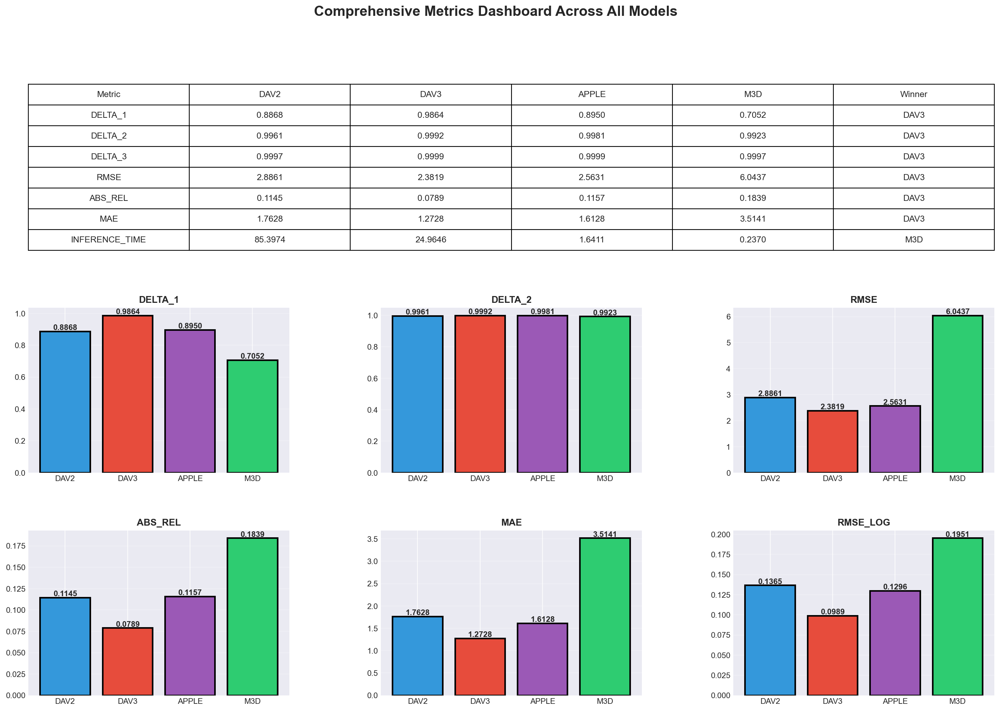

# RVAI Depth Estimation Project

This repository contains a comprehensive benchmarking and visualization suite for **Monocular Metric Depth Estimation** models evaluated on the **KITTI Depth Prediction Benchmark**.

The project compares four state-of-the-art depth estimation models:

- **Depth Anything V2**  
- **Depth Anything V3**  
- **Metric3D**  
- **Apple DepthPro**

Each model is evaluated on identical KITTI samples, and detailed metrics + visualizations are generated for all models.

---

## 📊 Model Comparison Summary

All models were evaluated on the same 20 KITTI validation samples using the following metrics:

- **δ₁, δ₂, δ₃ accuracy**
- **AbsRel**
- **RMSE**
- **RMSE_log**
- **MAE**
- **Inference Time**

A unified visualization pipeline was built to compare the four models fairly.

---

## 🖼️ Example Comparison Plot

Below is the combined metric comparison plot generated by the project:

> **(Replace this section with your generated comparison plot)**  
> Example placeholder:

This figure shows relative performance across all key metrics — accuracy, error distributions, and inference time.

---

## 📁 Results & Visualization

Each model has its own dedicated results directory containing:

- Metric JSON files  
- Predicted depth maps  
- Error heatmaps  
- Evaluation plots  
- Model-specific visualization outputs  

The main comparison visualizations are stored inside:

Each model’s raw outputs remain inside their respective project folders:

- `DAV2/`
- `DAV3/`
- `Metric3D/`
- `Apple-Depth-pro/`

---

## ✨ Project Highlights

- Unified inference + evaluation across 4 depth estimation models  
- Consistent KITTI benchmark pipeline  
- Side-by-side visual comparison for accuracy and error  
- Fully GPU-ready (Kaggle-compatible) evaluation scripts  
- Clean visualization dashboards for research and reporting  
- Metrics stored in simple, reusable JSON formats  

---

## 👤 Author

**Sucheta R. Shinganmakki**

---

## 📄 License

This repository follows the licenses of the individual model implementations used.  
Each model retains its corresponding upstream license.

